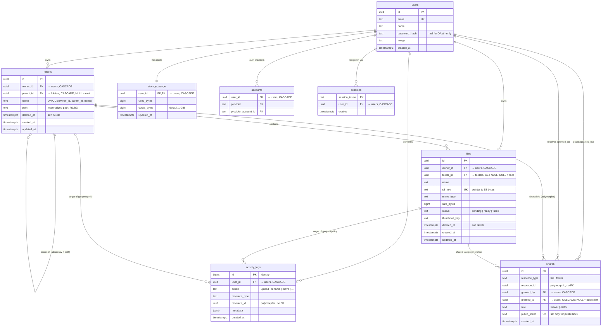

The big picture

Six domain tables plus three Auth.js tables. The core idea: Postgres owns all structure and metadata; S3 owns only bytes. A "file" in the UI is really a row in files pointing at an S3 object; folders don't exist in S3 at all.

users ──┬── folders (tree via parent_id + path)
        ├── files (each points to a folder + an s3_key)
        ├── shares (who else can see what)
        ├── activity_logs (what happened)
        └── storage_usage (quota counter, 1:1)

users + auth tables

users holds identity: email (unique), optional password_hash (nullable so a future Google/GitHub OAuth user can exist without a password), image,
timestamps. accounts, sessions, verification_tokens are the shater expects — sessions means we use database sessions: thebrowser cookie holds only a random token, and the actual session (who, until when) lives in a row we can revoke.

folders — the interesting one

The tree is stored two ways at once, deliberately:

- parent_id (adjacency list) — the source of truth. Listing a folder's children is one indexed query: WHERE parent_id = X. The FK with ON DELETE CASCADE
means the database guarantees no orphan subtrees.
- path (materialized path) — a denormalized string of ancestor ids, like /a1/b2/. This exists because three operations are painful with only parent_id:
  a. Subtree queries — "everything under folder b2" is WHERE pa of a recursive CTE. That's what idx_folders_path withtext_pattern_ops accelerates (plain btree indexes can't serve LIKE 'prefix%' in non-C locales; this operator class fixes that).
  b. Permission inheritance — to check if a file is shared via  its folder's path into ids and do one IN query against shares.No tree walking.
  c. Cycle prevention on move — moving folder A into folder B i, which is just "B.path starts with A.path". One stringcomparison.

The cost of denormalization: on a move, you must rewrite descendants' paths (UPDATE ... SET path = replace(path, old_prefix, new_prefix) WHERE path LIKE
old_prefix || '%') in the same transaction. That's the trade — pensive so reads, permissions, and safety checks get muchcheaper. Moves are rare; reads are constant.

Two constraints worth noting:

- UNIQUE (owner_id, parent_id, name) NULLS NOT DISTINCT — no two siblings share a name. The NULLS NOT DISTINCT part matters: root folders have parent_id
= NULL, and by default SQL treats every NULL as distinct, so witen root folders all named "Documents". This clause makes NULLcompare equal, enforcing uniqueness at the root too.
- idx_folders_owner_parent ... WHERE deleted_at IS NULL — a paristing query excludes trashed items, so the index only coverslive rows: smaller, faster, and trashed rows don't pollute it.

files

Each row is metadata for one S3 object:

- s3_key (unique) — the pointer to bytes, shaped like users/{userId}/files/{fileId}. Note it contains no folder info: moving a file just updates
folder_id; S3 is untouched. name is the display filename, applie presigned URL's content-disposition.
- folder_id is ON DELETE SET NULL, unlike folders' cascade — if a folder row is ever hard-deleted, its files fall back to root rather than losing their
metadata while bytes still sit in S3. Deleting a file row withowould leak storage; this default fails safe.
- status (pending | ready | failed, enforced by a CHECK) — the upload lifecycle. The row is created before the browser uploads to S3, so there's a window
where metadata exists but bytes don't. Listings only show readytale pending rows. This is the standard pattern forpresigned-URL uploads.
- size_bytes is bigint because files exceed the 2 GB integer li
- Same partial-index trick: one index for live files per folder, a separate one (WHERE deleted_at IS NOT NULL) that serves only the Trash page.
- The GIN trigram indexes on files.name and folders.name (via t substring/fuzzy search (ILIKE '%report%', similarity()) indexed instead of a full table scan — that's the whole search feature, no Elasticsearch needed.

shares — the permissions model

One table does double duty:

- User share: granted_to = a user id, role = viewer or editor.
- Public link: granted_to = NULL, public_token = an unguessable page looks up.

resource_type + resource_id is a polymorphic reference (can poi— which is why there's no FK on resource_id; the applicationenforces validity. That's a deliberate trade of a little integrity for one table instead of four (file_shares, folder_shares, ×2 for links).

Permission resolution is a computation, not a table: owner → direct share → share on any ancestor folder (found via the materialized path), highest role
wins. Sharing a folder implicitly shares everything inside it wf rows — new files inherit access automatically becauseresolution walks up the tree at read time.

activity_logs

Append-only event stream: who (user_id), what (action), to which resource, plus a jsonb metadata bag for action-specific details (old name on a rename,
destination on a move) — jsonb avoids a column per event type.  bigint identity rather than uuid: it's cheap, and insertionorder ≈ time order. The two indexes mirror the two screens that read it: (user_id, created_at DESC) for "my activity feed", (resource_type, resource_id,
created_at DESC) for "history of this file". Nothing ever updat

storage_usage

A 1:1 counter per user rather than SUM(size_bytes) on demand — y quota check gets slow and, worse, racy. The counter enablesthe atomic reservation trick:

UPDATE storage_usage
SET used_bytes = used_bytes + $size
WHERE user_id = $id AND used_bytes + $size <= quota_bytes;

If zero rows update, quota is exceeded — check and reservation happen in one atomic statement, so two simultaneous uploads can't both squeeze past the
limit. It's updated in the same transaction as the files insert.

Cross-cutting choices

- UUIDs for domain PKs — safe to expose in URLs (/drive/a1b2... users' resources, and generatable client- or server-side.
- Soft delete (deleted_at) on files and folders — powers Trash/restore; a background job hard-deletes (row + S3 object + quota release) after 30 days.
- CHECK constraints instead of Postgres enums for status/role —g a value later is a trivial constraint swap instead of an enummigration.
- timestamptz everywhere — timestamps store an absolute instanttimezone bugs.

If you want, the ER diagram in §4 of solution.md shows the sameand the next step (repositories + seed) will make these designchoices concrete in code.

## Entity-Relationship Diagram

Reading the arrows: `||--o{` means one-to-many (one user owns many folders), `||--||` is one-to-one (each user has exactly one `storage_usage` row). The dashed "polymorphic" relationships from `shares` and `activity_logs` are conventions enforced by application code, not real foreign keys — `resource_id` can point at either a file or a folder depending on `resource_type`. `verification_tokens` is omitted since it relates to nothing (it's keyed by email identifier, used only during email verification flows).